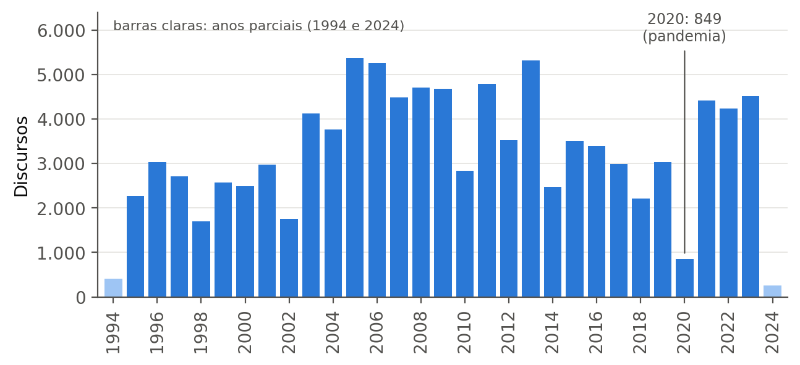
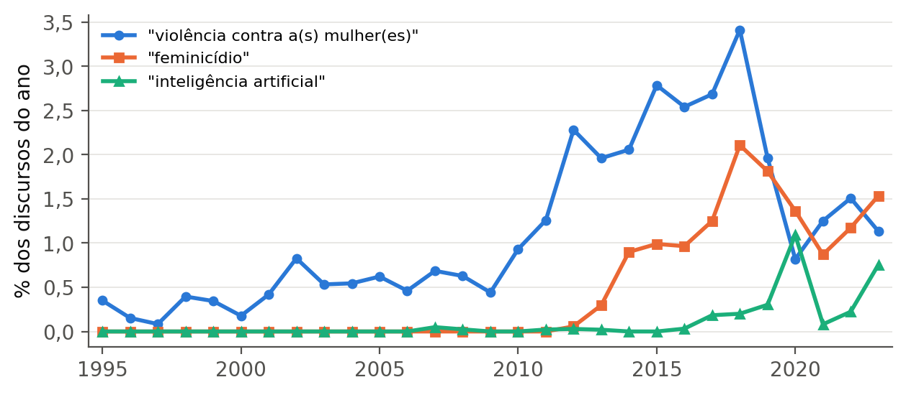

# AuditAI Senado: Transparência e Análise Parlamentar com IA

Projeto da disciplina **Inteligência Artificial** — 7º semestre de Ciência da Computação
Universidade Presbiteriana Mackenzie — Faculdade de Computação e Informática (FCI)
Professor: Prof. Dr. Ivan Carlos Alcântara de Oliveira — Turma 7º N
Repositório: <https://github.com/igorsa-hub/auditai-senado>

| Integrante | RA | E-mail |
|---|---|---|
| Andrey Bezerra Virgínio dos Santos | 10420696 | 10420696@mackenzista.com.br |
| Igor Silva Araujo | 10428505 | 10428505@mackenzista.com.br |
| Julia Vitória Bomfim do Nascimento | 10425604 | 10425604@mackenzista.com.br |
| William Saran dos Santos Junior | 10420128 | 10420128@mackenzista.com.br |

## Sobre o projeto

O Senado Federal publica dezenas de milhares de discursos, mas o volume torna difícil saber **quais parlamentares abordam um tema e o que efetivamente disseram**. O AuditAI Senado será um **agente inteligente** que responde a perguntas em linguagem natural (ex.: *"Quais parlamentares mais abordaram violência contra a mulher?"*) usando **Processamento de Linguagem Natural, busca semântica (embeddings) e geração aumentada por recuperação (RAG)**: localiza os trechos de discursos relacionados ao tema, agrupa os resultados por parlamentar e apresenta os trechos como evidência, com ligação para a página oficial.

- **Área:** política, transparência pública, cidadania digital.
- **ODS 16 — Paz, Justiça e Instituições Eficazes** (metas 16.6 e 16.10: instituições transparentes e acesso público à informação).
- **Dados:** *Brazilian Senate Speeches* (Kaggle, CC BY-NC-SA 4.0) — ver [`dataset/README.md`](dataset/README.md).

## Status

| Etapa | Bimestre | Status |
|---|---|---|
| E1 Aquisição e caracterização do dataset | N1 | concluída |
| E2 Análise exploratória | N1 | concluída |
| E3 Preparação (limpeza, filtros, segmentação em trechos) | N1 | concluída |
| E4 Indexação (BM25 + vetorial) | N2 | planejada |
| E5 Agente com LLM + RAG | N2 | planejada |
| E6 Interface web | N2 | planejada |
| E7 Avaliação (Recall@k, MRR, nDCG@10, fidelidade) | N2 | planejada |

## Estrutura do repositório

```
auditai-senado/
├── artigo/
│   ├── artigo_parcial_AuditAI_Senado.pdf     # artigo parcial (N1), template SBC
│   └── latex/                                # fonte LaTeX, template SBC, figuras e referências
├── dataset/
│   ├── README.md                             # descrição do dataset, licença e como obtê-lo
│   └── amostra/                              # amostras dos dados preparados (CSV)
├── data/
│   ├── raw/                                  # partidos.json e externos.json (fsdb_lite.json: baixar do Kaggle)
│   └── processed/                            # bases preparadas (geradas pelo notebook; não versionadas)
├── notebooks/
│   └── 01_analise_exploratoria_preparacao.ipynb   # EDA + preparação, executado com resultados
├── src/
│   ├── carregamento.py                       # leitura do JSON em streaming (ijson)
│   └── preparacao.py                         # limpeza, filtros e segmentação em trechos
├── resultados/
│   ├── figuras/                              # gráficos (PNG e PDF)
│   ├── tabelas/                              # tabelas da análise (CSV)
│   └── metricas.json                         # números citados no artigo
├── requirements.txt
└── README.md
```

## Como reproduzir

```bash
pip install -r requirements.txt
python -c "import nltk; nltk.download('stopwords')"
# baixe fsdb_lite.json do Kaggle para data/raw/ (ver dataset/README.md)
jupyter nbconvert --to notebook --execute --inplace notebooks/01_analise_exploratoria_preparacao.ipynb
```

A execução completa leva cerca de 5 minutos e usa até ~5 GB de RAM. Figuras, tabelas, `resultados/metricas.json` e as bases em `data/processed/` são regenerados.

## Principais resultados da N1

- **100.667** registros de **486** parlamentares; cobertura efetiva **1994 – mar/2024** (e não 1988–2024).
- **9,9%** dos registros sem texto autoral; **~18%** das palavras são de outros oradores → só o texto **Autoral** é indexado.
- `externos.json` inclui suplentes que foram senadores → **não** é usado como filtro.
- Busca literal por "violência contra a mulher": **815** discursos; com termos relacionados: **1.708** (+109,6%). "Feminicídio" só aparece com frequência a partir de 2013 (deriva de vocabulário) → justifica a busca semântica.
- Base final: **89.017** discursos → **558.569 trechos** (≤250 palavras, sobreposição de até 50) com autor, partido, data e URL.

| Discursos por ano | Evolução de termos |
|---|---|
|  |  |

## Licença dos dados

Os dados derivados do *Brazilian Senate Speeches* (amostras em `dataset/amostra/` e arquivos auxiliares em `data/raw/`) seguem a licença **CC BY-NC-SA 4.0** do conjunto original (LicoLabres, 2024).
